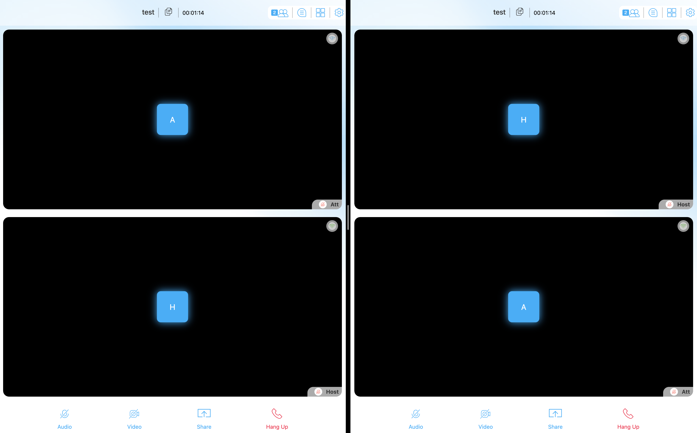

== Agora App Builder ==
Instructions to run your project:

1. Open a terminal inside this folder
2. Run - npm i && npm start (You need NodeJS v16.x installed on your system)
3. Select install through the CLI menu
4. Build for any supported platform

Changes done

- Top bar component is overridden using the timer component

Demo link

https://appbuilder-sample-fpe-events-git-timer-agoraio.vercel.app/

Screenshot

